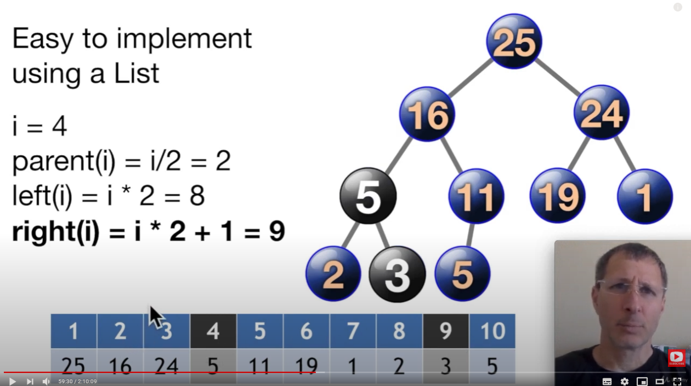

# MaxHeap


### What is a MaxHeap?
- Complete Binary Tree
- Every node <= its parent

# MaxHeap Time Complexity!


### MaxHeap is FAST!
- Insert in O(log n)
- Get max in O(1)
- Remove Max in O(log n)



### MaxHeap Operations
- Push (insert)
- Peek (get max)
- Pop (remove max)

### Push
- Add value to the end of array
- Float it up to its proper position


### Peek
- Returns the value at heap[1]


### Pop
- Move max to end of array
- Delete it
- Bubble down the item at index to its proper position
- Return max


### Python MaxHeap
A MaxHeap always bubbles the highest value to the top, so it can be remove instantly.  
Public functions: push, peek, pop  
Private functions: swap, __floatUp, __bubbleDown, __str.

```
class MaxHeap:
    def __init__(self, items=[]):

```
