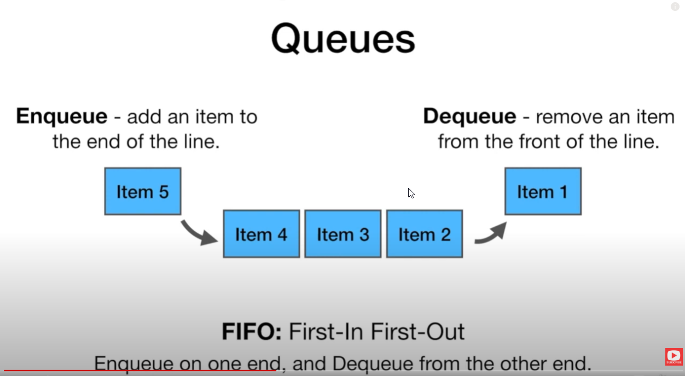

# Queues

### Queue using Python Deque
Queue is a FIFO date structure -- first in, first out.  
Deque is a double ended queue, but we can use it for queue.  
We use appened() to enqueue an item, and popleft() to dequeue an item.
Can refer to Python Docs for deque.
```
from collections import deque
my_queue = deque()
my_queue.append(5)
my_queue.append(10)
print(my_queue)
print(my_queue.popleft())
```
